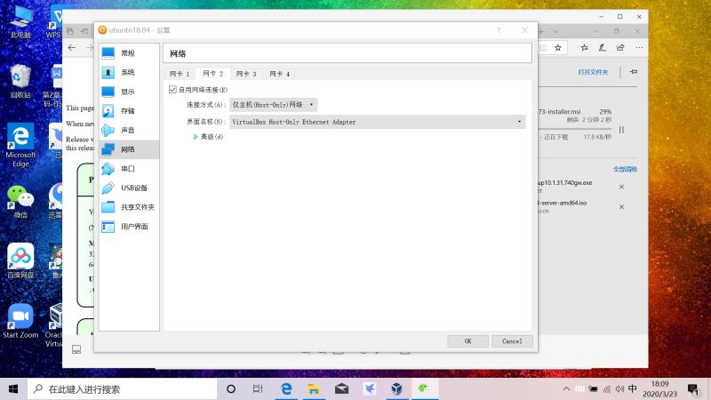
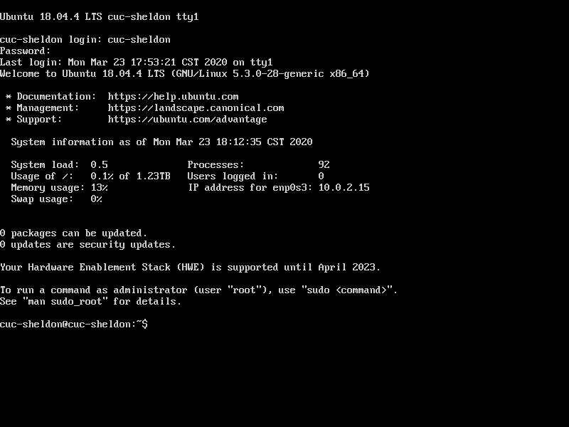
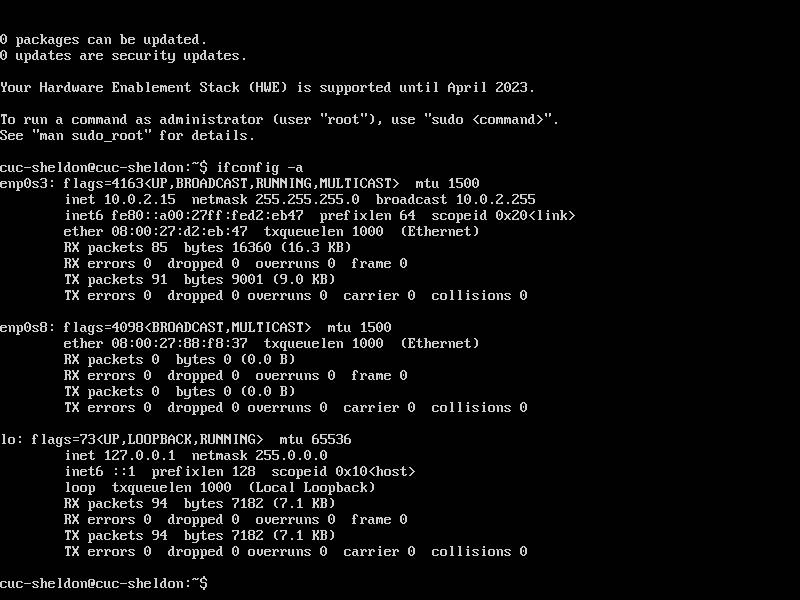
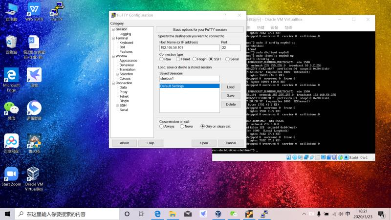
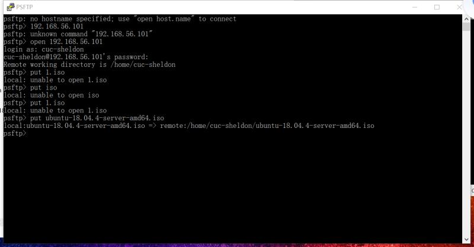
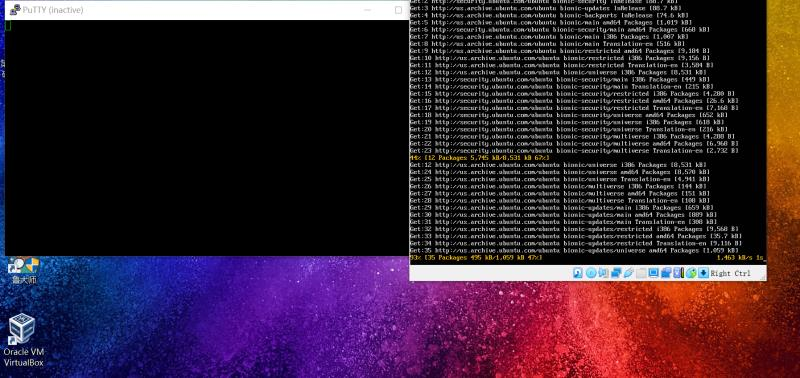

## 环境：

 

#### Windows10

 

#### VirtualBox 6

 

#### Ubuntu 18.04.4 Server 64bit

 

------

 

## 主要参考资料

 

[黄老师课件](https://github.com/c4pr1c3/LinuxSysAdmin)
 [无人值守Linux安装镜像制作](https://blog.csdn.net/qq_31989521/article/details/58600426)

 

------

 

## 一、如何使用sftp在虚拟机和宿主机之间传输文件？&  Virtualbox安装完Ubuntu之后新添加的网卡如何实现系统开机自动启用和自动获取IP ？

 

### 实现过程：

 

#### 1、官网下载PUTTY(64-bit)

 

#### 2、设置网卡2，连接方式为Host-Only, 如图

 

 

#### 3、启动虚拟机ubuntu-server-18.04.4

 

#### 4、ubuntu命令行输入命令 `ifconfig -a`查看网卡状态, 如图

 



#### 5、发现有网卡enp0s8未启动, 使用命令`sudo ifconfig enp0s8 up

 

#### sudo dhclient enp0s8`手动启动，得到IP: 192.168.56.101

 

6、用PuTTY连接ubuntu，如图

 

#### 7、将镜像文件ubuntu-18.04.4-server-amd64.iso用psftp从Windows复制到

 

#### ubuntu的~/，命令`put ubuntu-18.04.01-server-amd64.iso`如图


 

------

 

### 遇到的问题**P** 和解决办法**S**（附参考资料链接**R**）

 

------

 

https://github.com/CUCCS/linux-2020-Loonyluna12345/blob/chap01/chap01/image/ConnectionRefused.PNG)

 

#### **S**:在unbuntu安装SSHD服务, 如图

 输入【sudo apt update】和【sudo apt install -y openssh-server】

#### **R**: [PuTTY连接虚拟机linux——connection refused问题](https://blog.csdn.net/gsycwh/article/details/79051799?depth_1-utm_source=distribute.pc_relevant.none-task&utm_source=distribute.pc_relevant.none-task)

 

------

 

#### **S**:  直接打开psftp.exe输入命令，传输成功

 

#### **R**: [无人值守Linux安装镜像制作](https://blog.csdn.net/qq_31989521/article/details/58600426)

 

------

 

## 二、如何配置无人值守安装iso并在Virtualbox中完成自动化安装。

 

### 实现过程

 

#### 在当前用户目录下（/home/cuc）创建一个用于挂载iso镜像文件的目录

 

```
mkdir loopdir
```

 

#### 挂载iso镜像文件到该目录

 

```
mount -o loop ubuntu-16.04.1-server-amd64.iso loopdir
```

 

#### 创建一个工作目录用于克隆光盘内容

 

```
mkdir clone
```

 

#### 同步光盘内容到目标工作目录

 

```
rsync -av loopdir/ clone
```

 

#### 卸载iso镜像

 

umount loopdir

 

#### 进入目标工作目录

 

```
cd clone/
```

 

#### 编辑Ubuntu安装引导界面增加一个新菜单项入口

 

```
vim isolinux/txt.cfg
```

 

##### 添加以下内容到该文件后强制保存退出

 

label autoinstall menu label ^Auto Install Ubuntu Server kernel /install/vmlinuz append  file=/cdrom/preseed/ubuntu-server-autoinstall.seed debian-installer/locale=en_US console-setup/layoutcode=us keyboard-configuration/layoutcode=us console-setup/ask_detect=false localechooser/translation/warn-light=true localechooser/translation/warn-severe=true initrd=/install/initrd.gz root=/dev/ram rw quiet

 

#### 将Ubuntu官方文档preseed.cfg从宿主机Windows复制到虚拟机，并保存到新创建的工作目录~/cd/preseed/ubuntu-server-autoinstall.seed

 

#### 修改isolinux/isolinux.cfg，增加内容timeout 10

 

#### 重新生成md5sum.txt（用root登陆）

 

```
cd /home/cuc/cd && find . -type f -print0 | xargs -0 md5sum > md5sum.txt
```

 

#### 封闭改动后的目录到.iso

 

IMAGE=custom.iso BUILD=/home/cuc/cd/ 安装genisoimage `sudo apt install genisoimage` mkisofs -r -V "Custom Ubuntu Install CD" 
 -cache-inodes 
 -J -l -b isolinux/isolinux.bin 
 -c isolinux/boot.cat -no-emul-boot 
 -boot-load-size 4 -boot-info-table 
 -o $IMAGE $BUILD

 

#### 查看~/clone下制作好的custom.iso

 


#### 在windows打开psftp窗口, 执行`get custom.iso`, 从虚拟机中将custom.iso这个镜像文件复制出来

 

------

 

### 